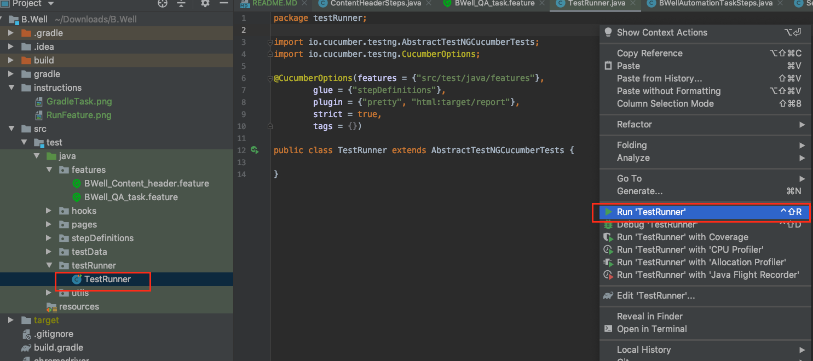
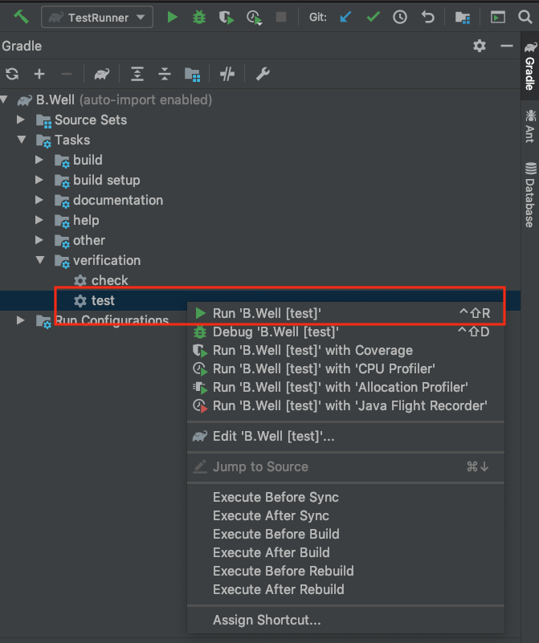
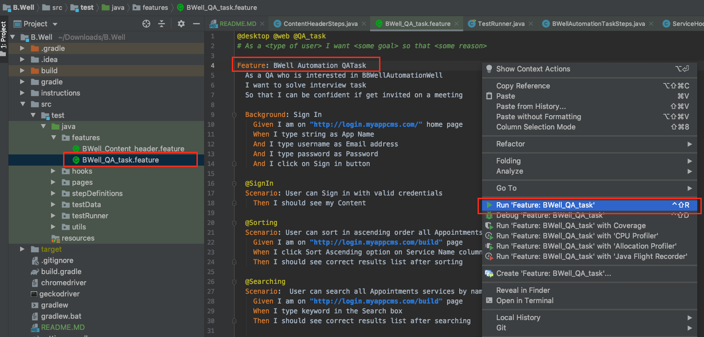

Java based UI automation utilizing BDD Cucumber-JVM and the Selenium WebDriver framework + Gherkin + Gradle + TestNG + Cucumber.js IntelliJ IDEA plugin

It takes few minutes minutes to perform default background Gradle tasks and indexing after opening the project in IntelliJ IDEA.
 
 
`Methodologies`  
I used best practice of utilizing Page Object Modal for the BDD framework.  
Implemented modules:  
`pages` (each object there represents unique page of the application)  
`features` (test scenarios - high level description)  
`stepDefinitions` (actual implementation of the test scenarios from the feature files)
`hooks` (actions which are executed before/after running each test)  
`testData` (test data is places into JSON object which is easily reachable from the step definitions classes. Other option is to hard code test data into feature files)  
`utils` (locators, browser and environment configurations, data importer class).  
`testRunner` (TestRunner class extends AbstractTestNGCucumberTests)  
 
There are 2 test classes in stepDefinitions module:
1) `BWellAutomationTaskSteps` -  includes test scenarios from given _BWell_QA_task.feature_ Gherkin file
2) `ContentHeaderSteps` - includes test scenarios for the header of the application such as Sign Out, Header Navigation and Changing language support.

`Analysis of the Framework`:  
I have in mind few thinks which should be investigated and improved:
1) I found using Background code repetitive in each feature file. It would be nice to use some global type of the background which could be written in one file and be used over the entire feature files. Looks like Cucumber had this support in earlier versions but I would like to talk about it and possible improvement of the framework. 
2) In my environment during test execution there were many warning notification in the console. I temporarily disabled them but for a long term perspective it's important to make sure that all dependencies and libraries are configured correctly along with system properties.
3) It would be nice to configure headless browser mode for the test execution. This helps to not worry about switching windows between IDE and browser during test execution and debugging.
4) The framework should be integrated with CI/CD tool to run tests remotely, track all results and setup scheduling for execution.
5) DataBase manager with SQL queries is also part of the POM for the long term perspective which is configurable.

-------------------------- Running via TestRunner class --------------------------
1. Navigate to /src/tests/java/testRunner
2. Open TestRunner class
3. Right click and select run option. Or click on run icon next to TestRunner class
4. Add _tags = {}_ from the feature files into @CucumberOptions annotation to run only specific scenario or feature file (e.g. _tags = {"@SignIn"}_ or _tags = {"@QA_task"}_)

-------------------------- Running via gradle task in IDEA Gradle window --------------------------

1. Open Gradle window
2. Navigate to B.Well Tasks -> verification
3. Run "test" task

-------------------------- Running specific feature or test scenario from _.feature file_ --------------------------

1. Navigate to /src/tests/java/features
2. Open feature file
3. Right click next to feature or scenario
4. Select option run

-------------------------- Running via terminal --------------------------

1. cd to the project directory
2. Run ./gradlew clean test

